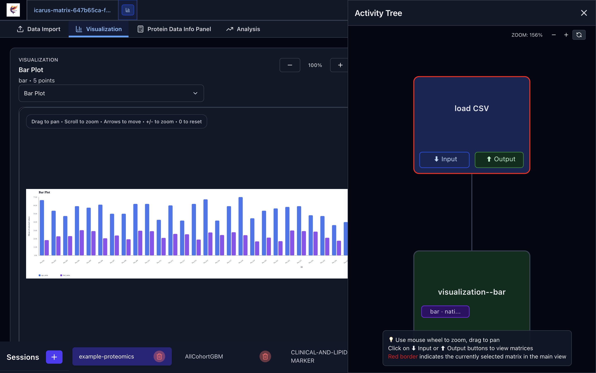
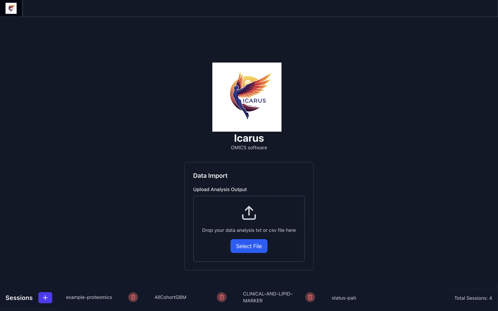

<div align="center">
  

  # Icarus
  Desktop statistical analysis and visualization workspace for proteomics-style matrices and other tabular datasets.
</div>

---

## Overview

Icarus is an Electron + React application for importing structured text data, shaping it into matrices, running column-focused statistical analyses, and creating matrix-linked visualizations with multiple renderers.

The current app is built around a few core ideas:

- matrix-first workflows
- persistent activities and visualizations
- renderer-aware plots (`Python`, `R`, and native)
- a dark-mode capable desktop UI
- a workflow/activity tree that lets users navigate analysis history and linked outputs

---

## Current Features

### Data import

- Import `.txt`, `.tsv`, and `.csv` files
- Handles common proteomics-style exports, including MaxQuant-like tabular formats
- Uses a resilient parsing pipeline with delimiter detection, quoted-field support, ragged-row handling, header normalization, and parser fallback
- Shows imported matrices in a table-first `Data Import` view

### Matrix and session workflow

- Session-based workflow management
- Matrix tabs with visualization tabs nested inside the owning matrix context
- Source-matrix tracking for saved visualizations and activities
- Activity tree navigation for matrices and visual outputs

### Statistical analysis

- Column-focused descriptive statistics such as mean, median, variance, standard deviation, counts, min, and max
- Filtering, imputation, normalization, outlier detection, and matrix reshaping operations
- Differential-expression oriented actions such as fold-change, t-test, ANOVA, LIMMA-related flows, and clustering/PCA analysis surfaces
- Statistical result handling mapped back to the appropriate UI views

### Visualization workspace

- Plot library lives in the visualization area, separate from raw statistical calculations
- Supported plot types include bar, box, scatter, heatmap, volcano, and PCA
- Renderer selection for plot creation: `Python`, `R`, or native
- Renderer selection for plot viewing: saved renderer, `Python`, `R`, or native when available
- Matrix-linked saved visualizations
- Plot-focused viewer instead of a cluttered multi-plot canvas
- Download support for rendered visualizations
- Axis label and tick configuration
- Zoom, pan, keyboard navigation, and floating viewer settings

### Theme support

- Light mode
- Dark mode
- System theme support
- Persistent theme selection
- Dark-mode coverage across tables, forms, menus, activity tree surfaces, modals, and visualization panels

### Desktop packaging

- Electron desktop application
- GitHub Actions build flow for desktop packaging
- Unsigned macOS fallback packaging flow for environments without Apple notarization credentials

---

## Checkpoints Completed

- [x] Matrix-linked visualization workflow
- [x] Visualization tabs nested under matrix context
- [x] Activity-tree navigation into visualizations
- [x] Plot library refactor for centralized visualization creation
- [x] Python, R, and native renderer support
- [x] Heatmap and volcano plot support
- [x] Persistent visualization records
- [x] Visualization viewer zoom/pan controls
- [x] Floating visualization settings panel
- [x] Full light/dark/system theme support
- [x] Statistics hook cleanup and utility separation
- [x] More resilient import parsing pipeline
- [x] CI packaging cleanup for desktop release flow

---

## Product Views

### Main workflow


### Data and activity workflow


### Visualization workflow


### Visualization and renderer options

The visualization workspace supports plot-library driven creation and renderer-aware viewing across `Python`, `R`, saved output, and native rendering.


### Dark mode renderer-aware visualization



### Analysis workflow


### Dark mode

Dark mode is supported across the table view, statistics menu, activity tree, and visualization workspace, with persistent `light`, `dark`, and `system` theme selection.


### Dark mode import workspace



---

## Tech Stack

| Category | Tools |
| --- | --- |
| Desktop app | Electron |
| Frontend | React, TypeScript |
| Styling | Tailwind CSS, tailwind-variants |
| Charts and visuals | Recharts, D3 |
| Statistics | jStat, simple-statistics |
| Data handling | Papa Parse plus custom resilient parser pipeline |
| Local storage / persistence | SQLite workflow storage |

---

## Getting Started

```bash
git clone <repo-url>
cd mission-icarus
npm install
npm start
```

### Useful commands

```bash
# dev bundle refresh before Electron start
npm run prestart

# lint
npm run lint

# typecheck
npx tsc --noEmit

# desktop build
npm run build
```

---

## Notes

- macOS notarization still requires Apple credentials; unsigned fallback packaging is supported for environments without them
- visualization creation is intentionally centralized in the visualization plot library so statistical calculations remain distinct from plot generation
