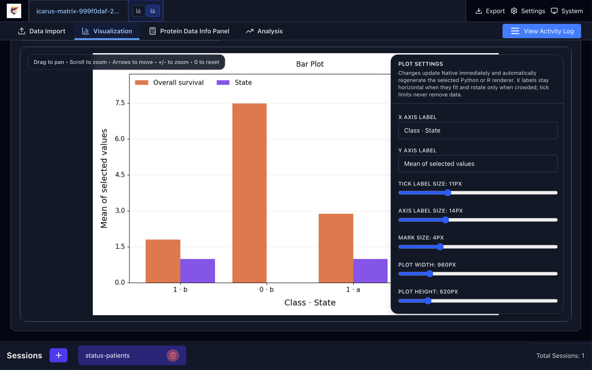
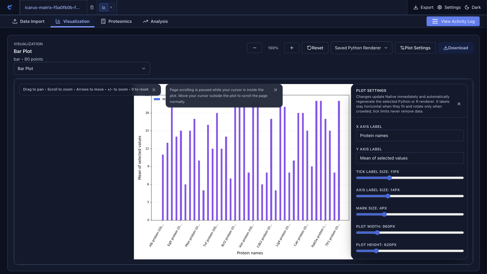
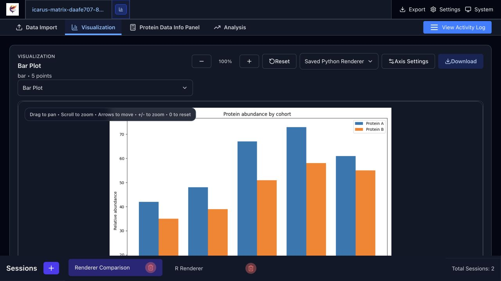
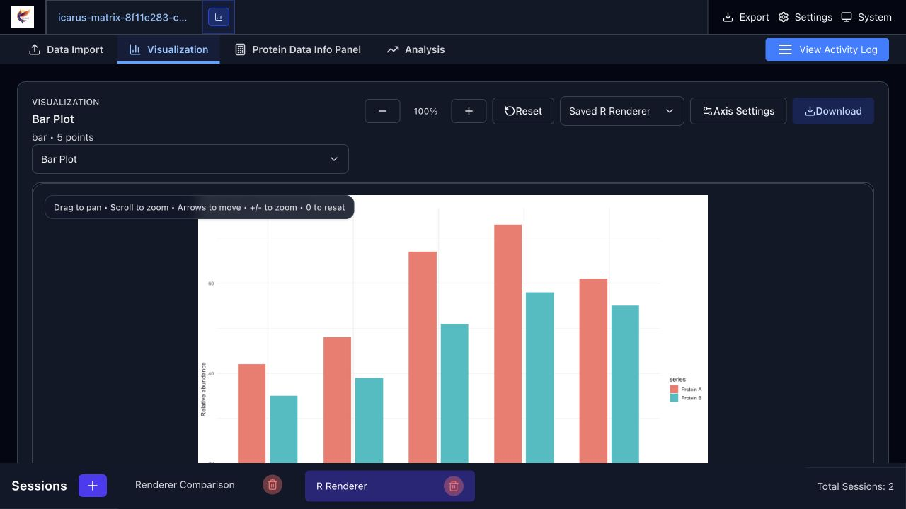
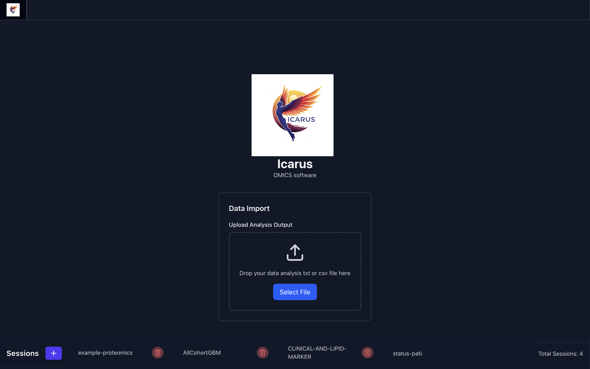

<div align="center">
  

  # Icarus
  Desktop statistical analysis and visualization workspace for proteomics-style matrices and other tabular datasets.
</div>

---

## Overview

Icarus is an Electron + React application for importing structured text data, shaping it into matrices, running column-focused statistical analyses, and creating matrix-linked visualizations with multiple renderers.

The current app is built around a few core ideas:

- matrix-first workflows
- persistent activities and visualizations
- renderer-aware plots (`Python` with Matplotlib, `R` with ggplot2, and native)
- a dark-mode capable desktop UI
- a workflow/activity tree that lets users navigate analysis history and linked outputs

---

## Data Structure

The core workflow is modeled as a **Directed Acyclic Graph (DAG)**, but it is not stored as a first-class graph object. Edges are implicit references held as identifiers, and the DAG is materialized as a tree only when needed.

- **Implicit adjacency list (edge-list by reference).** Each `IcarusActivity` links an input matrix to an output matrix via `inputMatrixReference(s)` and `outputMatrixReference` string identifiers. Matrices, activities, and visualizations are persisted as flat records; no explicit adjacency list or graph type is kept on disk.
- **DAG semantics.** Flow always moves forward (input → output) and never revisits a matrix, so the graph is acyclic.
- **Projection to a rooted n-ary forest for display.** The activity tree builders (`buildActivityTree` / `buildActivityTreeForNonD3`) walk the references with an `outputMatrixMap`, group activities that share an input matrix under an `inputMatrixKey` node, assign a `depth`, and produce `{ activity, children, depth }` nodes. Duplicate/shared parents are collapsed here, so the persisted DAG loses some multi-parent structure in the rendered tree.
- **Cascade traversal.** Deletion planning walks the same reference/cascade to compute dependent matrices, activities, and visualizations.

In short: an **implicit adjacency-list DAG** that is **materialized as a forest of n-ary trees** for rendering and dependency analysis.

```mermaid
flowchart LR
    S[IcarusSession] -->|owns| W[IcarusWorkflow]
    S -->|links records| M0[Source Matrix]

    subgraph G["Activity DAG (implicit)"]
        M0 -->|inputMatrixReference| A1[[Activity]]
        A1 -->|outputMatrixReference| M1[Matrix]
        M1 -->|inputMatrixReference| A2[[Activity]]
        A2 -->|outputMatrixReference| M2[Matrix]
        A2 -->|createdByActivityId| V[Visualization]
    end

    M1 -.->|tree projection| AT[Activity Tree (n-ary forest)]
    M2 -.->|depth/children| AT
```

`matrices`, `activities`, and `visualizations` are persisted as flat lists; the arrows above are identifier references (`*MatrixReference`), not stored node objects. The activity tree is a navigational projection of this graph.

---

## Current Features

### Data import

- Import `.txt`, `.tsv`, and `.csv` files
- Handles common proteomics-style exports, including MaxQuant-like tabular formats
- Uses a resilient parsing pipeline with delimiter detection, quoted-field support, ragged-row handling, header normalization, and parser fallback
- Shows imported matrices in a table-first `Data Import` view

### Matrix and session workflow

- Session-based workflow management
- Matrix tabs with visualization tabs nested inside the owning matrix context
- Source-matrix tracking for saved visualizations and activities
- Activity tree navigation for matrices and visual outputs

### Statistical analysis

- Column-focused descriptive statistics such as mean, median, variance, standard deviation, counts, min, and max
- Filtering, imputation, normalization, outlier detection, and matrix reshaping operations
- Differential-expression oriented actions such as fold-change, t-test, ANOVA, LIMMA-related flows, and clustering/PCA analysis surfaces
- Statistical result handling mapped back to the appropriate UI views

### Visualization workspace

- Plot library lives in the visualization area, separate from raw statistical calculations
- Supported plot types include bar, box, scatter, heatmap, volcano, and PCA
- Renderer selection for plot creation: Python (Matplotlib), R (ggplot2), or native
- Renderer selection for plot viewing: saved renderer, Python (Matplotlib), R (ggplot2), or native when available
- Matrix-linked saved visualizations
- Plot-focused viewer instead of a cluttered multi-plot canvas
- Download support for rendered visualizations
- Axis label and tick configuration
- Zoom, pan, keyboard navigation, and floating viewer settings

### Theme support

- Light mode
- Dark mode
- System theme support
- Persistent theme selection
- Dark-mode coverage across tables, forms, menus, activity tree surfaces, modals, and visualization panels

### Desktop packaging

- Electron desktop application
- GitHub Actions build flow for desktop packaging
- Unsigned macOS fallback packaging flow for environments without Apple notarization credentials

---

## Checkpoints Completed

- [x] Matrix-linked visualization workflow
- [x] Visualization tabs nested under matrix context
- [x] Activity-tree navigation into visualizations
- [x] Plot library refactor for centralized visualization creation
- [x] Python, R, and native renderer support
- [x] Heatmap and volcano plot support
- [x] Persistent visualization records
- [x] Visualization viewer zoom/pan controls
- [x] Floating visualization settings panel
- [x] Full light/dark/system theme support
- [x] Statistics hook cleanup and utility separation
- [x] More resilient import parsing pipeline
- [x] CI packaging cleanup for desktop release flow

---

## Product Views

### Main workflow


### Data and activity workflow


### Visualization and renderer options
The visualization workspace supports plot-library driven creation and renderer-aware viewing across Python (Matplotlib), R (ggplot2), saved output, and native rendering.

#### Plot settings


##### Native - Recharts



#### Python and R renderer samples
Alongside the Recharts bar plot shown above, these captures show the same grouped-bar payload rendered inside the Icarus visualization viewer through its Python and R chart engines.
##### Python — Matplotlib


##### R — ggplot2



### Analysis workflow


### Dark mode

#### Dark mode import workspace
##### Dark mode is supported across the table view, statistics menu, activity tree, and visualization workspace, with persistent `light`, `dark`, and `system` theme selection.



---

## Tech Stack

| Category | Tools |
| --- | --- |
| Desktop app | Electron |
| Frontend | React, TypeScript |
| Styling | Tailwind CSS, tailwind-variants |
| Charts and visuals | Python (Matplotlib, Seaborn), R (ggplot2), Recharts, D3 |
| Statistics | jStat, simple-statistics |
| Data handling | Papa Parse plus custom resilient parser pipeline |
| Local storage / persistence | SQLite workflow storage |

---

## Getting Started

```bash
git clone <repo-url>
cd mission-icarus
npm install
npm start
```

### Useful commands

```bash
# dev bundle refresh before Electron start
npm run prestart

# lint
npm run lint

# typecheck
npx tsc --noEmit

# desktop build
npm run build
```

---

## Notes

- macOS notarization still requires Apple credentials; unsigned fallback packaging is supported for environments without them
- visualization creation is intentionally centralized in the visualization plot library so statistical calculations remain distinct from plot generation
