<div align="center">
  

  # Icarus
  Desktop statistical analysis and visualization workspace for proteomics-style matrices and other tabular datasets.
</div>

---

## Overview

Icarus is an Electron + React application for importing structured text data, shaping it into matrices, running column-focused statistical analyses, and creating matrix-linked visualizations with multiple renderers.

The current app is built around a few core ideas:

- matrix-first workflows
- persistent activities and visualizations
- renderer-aware plots (`Python` with Matplotlib, `R` with ggplot2, and native)
- a dark-mode capable desktop UI
- a workflow/activity tree that lets users navigate analysis history and linked outputs
- a CSP-hardened production renderer

---

## Data Structure

Icarus separates the **logical workflow graph** from the **physical matrix storage**. The renderer-side source of truth is a versioned Dexie/IndexedDB database containing `sessions`, `activities`, `matrices`, `matrixChunks`, and `visualizations`. There is no persisted workflow record: the workflow is derived from the references between these normalized records.

### Workflow graph

- **Sessions are lightweight ID registries.** Each session stores its metadata plus ordered `activityIds`, `matrixIds`, and `visualizationIds`. `getSessionWithAllData` hydrates those independent records into the aggregate consumed by the UI.
- **Edges are identifier references.** An `IcarusActivity` consumes a matrix through `inputMatrixReferences` (currently one matrix ID), records provenance in `sourceMatrixId`, and may produce a matrix through `outputMatrixReference`. Statistical activities produce a new matrix; visualization activities instead own an `IcarusVisualization` through `createdByActivityId` and retain the source matrix ID.
- **The workflow is a projection, not a stored object.** No `workflows` store or `workflowIds` session field is maintained. Database version 3 removes both from existing IndexedDB data without changing the linked activity, matrix, or visualization records.
- **The graph is projected to a rooted forest for navigation.** `buildActivityTree` and `buildActivityTreeForNonD3` match each activity's input matrix ID to the activity that produced it. Activities without a matching producer become roots, while multiple activities consuming the same matrix become sibling branches. The resulting `{ activity, children, depth }` nodes drive the D3 and non-D3 activity trees.
- **Graph mutations are dependency-aware.** Session creation, statistical results, and visualizations commit their records and session references atomically. Deletion planning follows matrix, activity, and visualization references, validates the cascade again at commit time, and preserves records still referenced by another session.

### Matrix storage

- **Metadata and payloads are separate.** Inactive matrices can be loaded as metadata-only `IcarusMatrix` records (`rowCount`, `columnCount`, `payloadState`) and hydrated only when selected.
- **Version 2 matrices are chunked.** Matrix metadata lives in `matrices`; row chunks live in `matrixChunks` under the compound key `[matrixId+chunkIndex]`. Entirely numeric chunk columns are stored as `Float64Array` buffers, while mixed or text columns use lossless value arrays.
- **Encoding is worker-backed and backward compatible.** Web Workers encode and decode matrix chunks. Legacy version 1 matrix objects remain readable and are converted to the chunked format in a background transaction after a successful read.

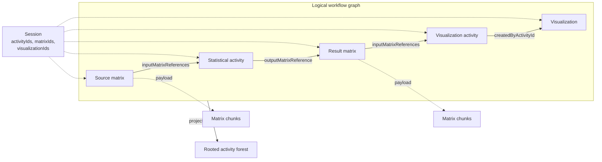
```mermaid
flowchart LR
    subgraph G["Logical workflow graph"]
        M0[Source matrix] -->|inputMatrixReferences| A1[Statistical activity]
        A1 -->|outputMatrixReference| M1[Result matrix]
        M1 -->|inputMatrixReferences| A2[Visualization activity]
        A2 -->|createdByActivityId| V[Visualization]
    end

    S["Session<br/>activityIds, matrixIds,<br/>visualizationIds"]
    S -.-> M0
    S -.-> M1
    S -.-> A1
    S -.-> A2
    S -.-> V

    M0 -.->|payload| C0[Matrix chunks]
    M1 -.->|payload| C1[Matrix chunks]

    G -->|project when rendered| AT[Rooted activity forest]
```

The solid arrows are logical data-flow relationships reconstructed from IDs; the records themselves remain flat. See [`docs/data-storage-architecture.md`](./docs/data-storage-architecture.md) for storage limits, hydration behavior, and large-dataset execution details.

---

## Current Features

### Data import

- Import `.txt`, `.tsv`, and `.csv` files
- Handles common proteomics-style exports, including MaxQuant-like tabular formats
- Uses a resilient parsing pipeline with delimiter detection, quoted-field support, ragged-row handling, header normalization, and parser fallback
- Parses well-formed delimited files with a single-pass columnar scanner: numeric cells are written directly into `Float64Array` columns via an exact IEEE-754 converter (`parsePlainDouble`), missing cells become `NaN`, and non-finite overflows widen a column to string. String columns are `string[]` with missing cells as `"N/A"`. The column-major `ColumnarTable` flows straight from the parser into the session matrix, preview, statistics, and exports — no intermediate row objects in the hot path (raw parse ~115 ms vs `pandas.read_csv` ~122 ms for 100k × 20 on an Apple M1)
- Shows imported matrices in a table-first `Data Import` view over the columnar table, with the public row-object `ParsedCSVResult` contract preserved only at the API boundary for fallback paths

### Matrix and session workflow

- Session-based workflow management
- Matrix tabs with visualization tabs nested inside the owning matrix context
- Source-matrix tracking for saved visualizations and activities
- Activity tree navigation for matrices and visual outputs

### Statistical analysis

- Column-focused descriptive statistics such as mean, median, variance, standard deviation, counts, min, and max
- Filtering, imputation, normalization, outlier detection, and matrix reshaping operations
- Differential-expression oriented actions such as fold-change, t-test, ANOVA, LIMMA-related flows, and clustering/PCA analysis surfaces
- Hybrid statistical execution: lightweight operations stay in a Web Worker; MICE, KNN, PCA, PLS-DA, t-SNE, clustering, and large matrix operations use a warm NumPy/SciPy/scikit-learn process, while LIMMA and WGCNA use canonical packages in a persistent R worker
- Statistical result handling mapped back to the appropriate UI views

### Visualization workspace

- Plot library lives in the visualization area, separate from raw statistical calculations
- Supported plot types include bar, box, scatter, heatmap, volcano, and PCA
- Renderer selection for plot creation: Python (Matplotlib), R (ggplot2), or native
- Renderer selection for plot viewing: saved renderer, Python (Matplotlib), R (ggplot2), or native when available
- Matrix-linked saved visualizations
- Plot-focused viewer instead of a cluttered multi-plot canvas
- Download support for rendered visualizations
- Axis label and tick configuration
- Zoom, pan, keyboard navigation, and floating viewer settings

### Theme support

- Light mode
- Dark mode
- System theme support
- Persistent theme selection
- Dark-mode coverage across tables, forms, menus, activity tree surfaces, modals, and visualization panels

### Renderer security

- Production builds ship a strict Content Security Policy (`default-src 'self'`, no inline scripts, no `unsafe-eval`) injected into `dist/index.html` at build time
- The policy allowlists exactly what the renderer needs: bundled scripts and Web Workers, data/blob plot images, and inline style attributes; dev-server HMR is unaffected since the meta is build-only

### Desktop packaging

- Electron desktop application
- GitHub Actions build flow for desktop packaging
- Unsigned macOS fallback packaging flow for environments without Apple notarization credentials

---

## Checkpoints Completed

- [x] Matrix-linked visualization workflow
- [x] Visualization tabs nested under matrix context
- [x] Activity-tree navigation into visualizations
- [x] Plot library refactor for centralized visualization creation
- [x] Python, R, and native renderer support
- [x] Heatmap and volcano plot support
- [x] Persistent visualization records
- [x] Visualization viewer zoom/pan controls
- [x] Floating visualization settings panel
- [x] Full light/dark/system theme support
- [x] Statistics hook cleanup and utility separation
- [x] More resilient import parsing pipeline
- [x] CI packaging cleanup for desktop release flow
- [x] Content Security Policy for the packaged renderer

---

## Product Views

### Main workflow


### Data and activity workflow


### Visualization and renderer options
The visualization workspace supports plot-library driven creation and renderer-aware viewing across Python (Matplotlib), R (ggplot2), saved output, and native rendering.

#### Plot settings


##### Native - Recharts
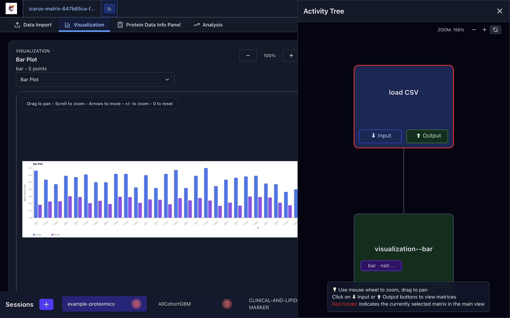


#### Python and R renderer samples
Alongside the Recharts bar plot shown above, these captures show the same grouped-bar payload rendered inside the Icarus visualization viewer through its Python and R chart engines.
##### Python — Matplotlib


##### R — ggplot2


### Analysis workflow


### Dark mode

#### Dark mode import workspace
##### Dark mode is supported across the table view, statistics menu, activity tree, and visualization workspace, with persistent `light`, `dark`, and `system` theme selection.


---

### Current-release supplements (v0.0.155)

Full-frame captures of every panel in both themes, taken with sidebars and sheets closed so each view fills the frame. The Visualization shots show a rendered Python/Matplotlib bar plot; the Proteomics shot shows computed summary statistics and the intensity distribution.

#### App overview

Session workspace with the sidebar open, showing session management, matrix tabs, and the activity log entry point.

#### Dark mode
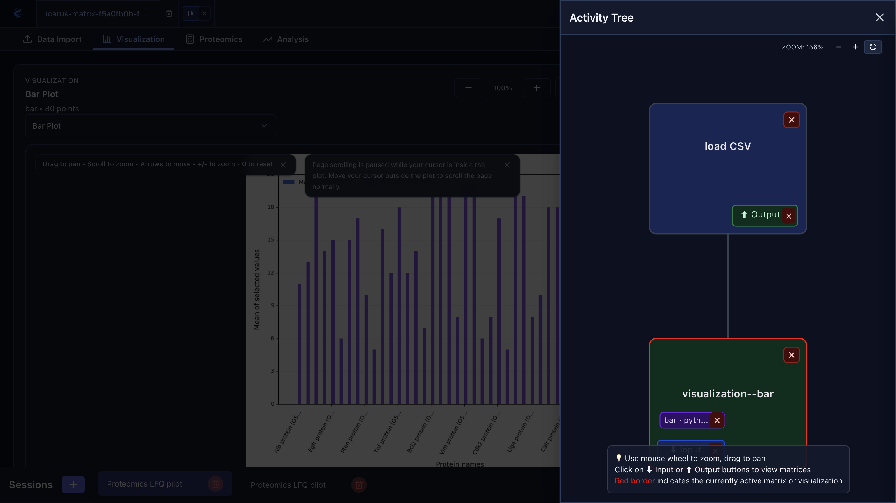

#### Light mode
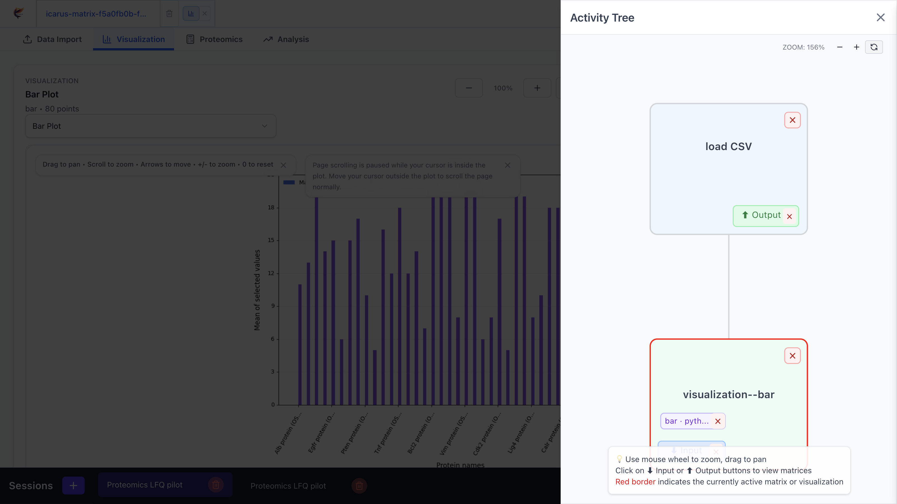

#### Data import

The upload screen for starting a session, followed by the table-first `Data Import` view rendered directly over the columnar table.

##### Upload screen
###### Dark mode
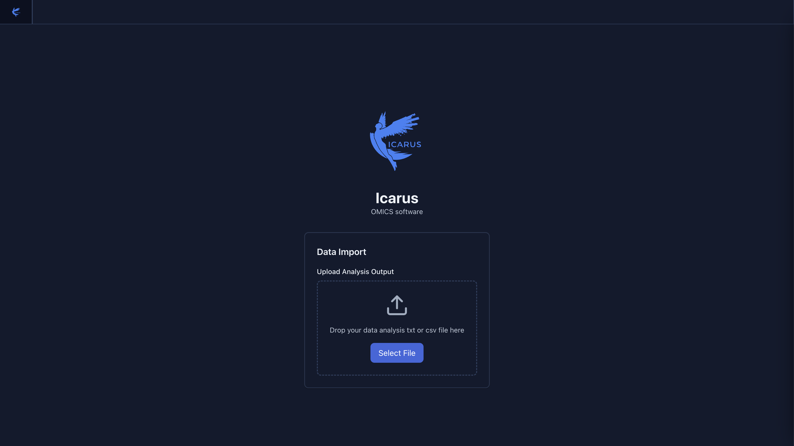

###### Light mode
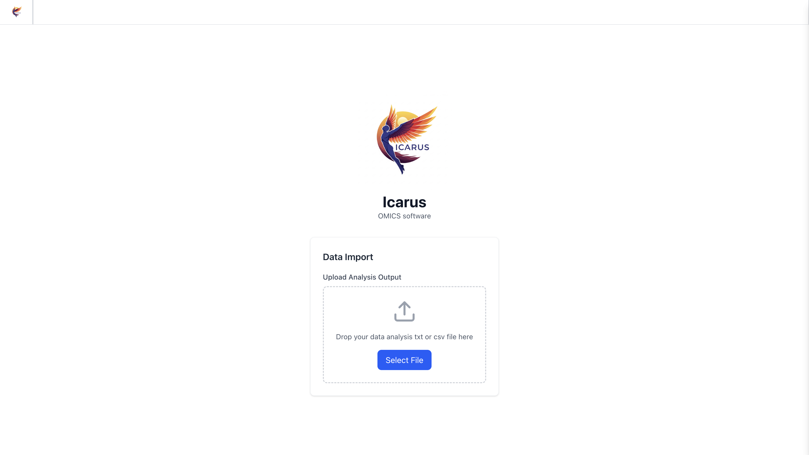

##### Imported matrix table
###### Dark mode
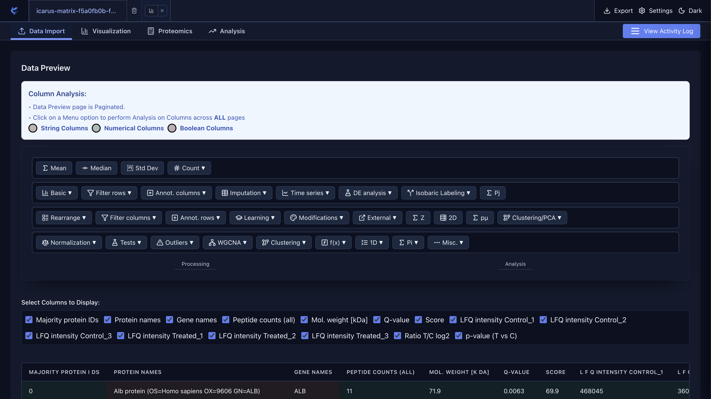

###### Light mode
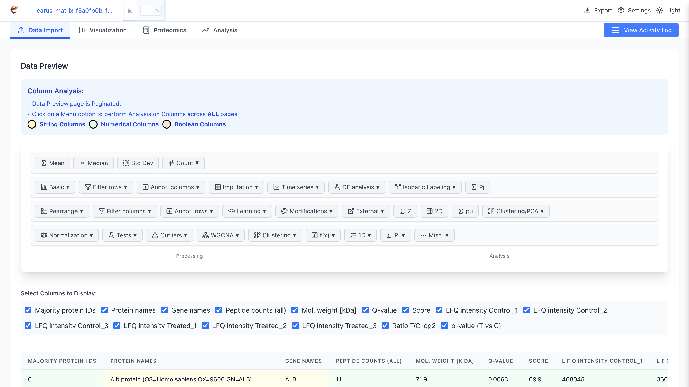

#### Proteomics tab

Dedicated proteomics analysis surface with column-focused statistics, imputation, normalization, and differential-expression oriented activities.

###### Dark mode
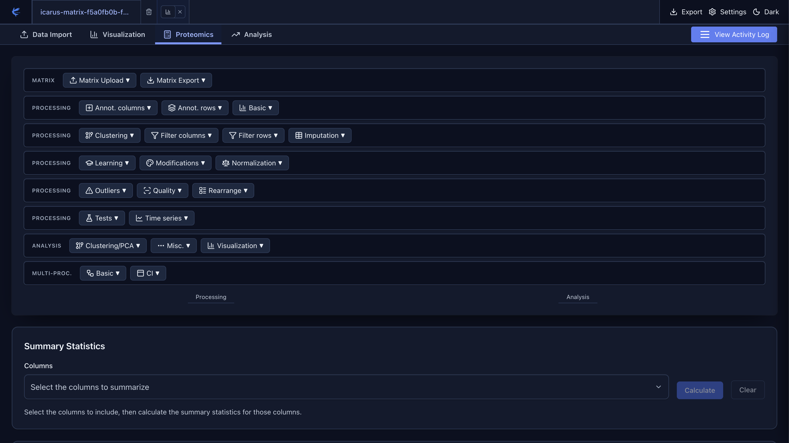

###### Light mode
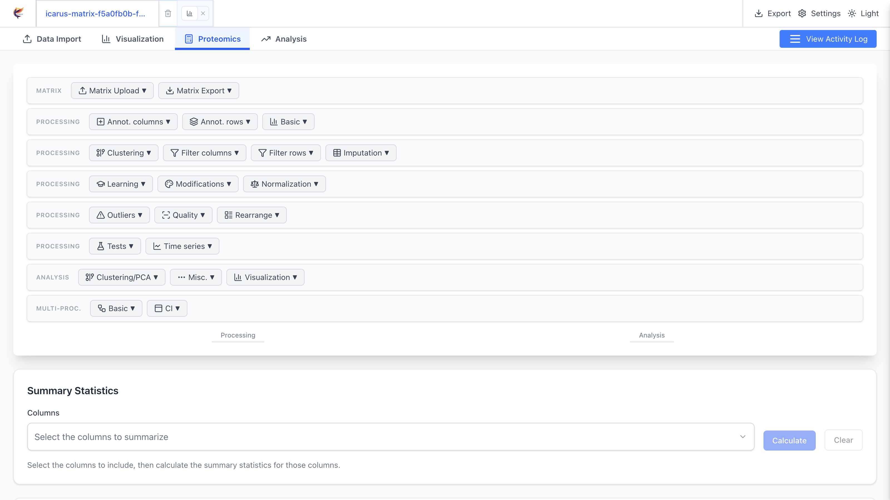

#### Analysis panel

###### Dark mode
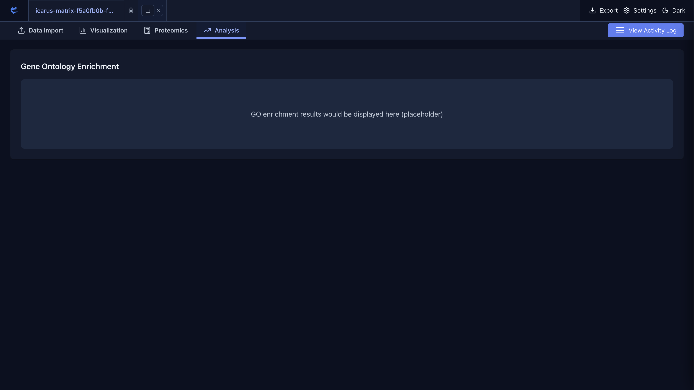

###### Light mode
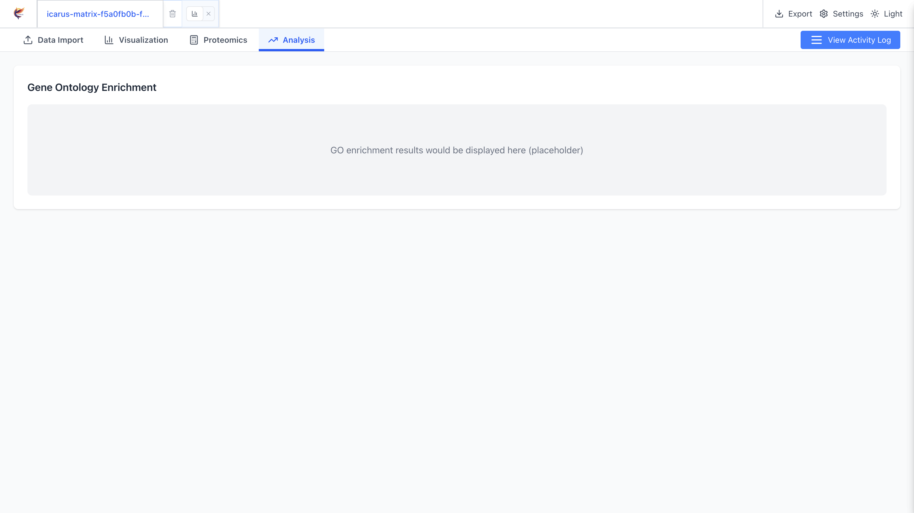

#### Visualization workspace

Plot-library driven creation with renderer-aware viewing across Python (Matplotlib), R (ggplot2), saved output, and native rendering.

###### Dark mode


###### Light mode
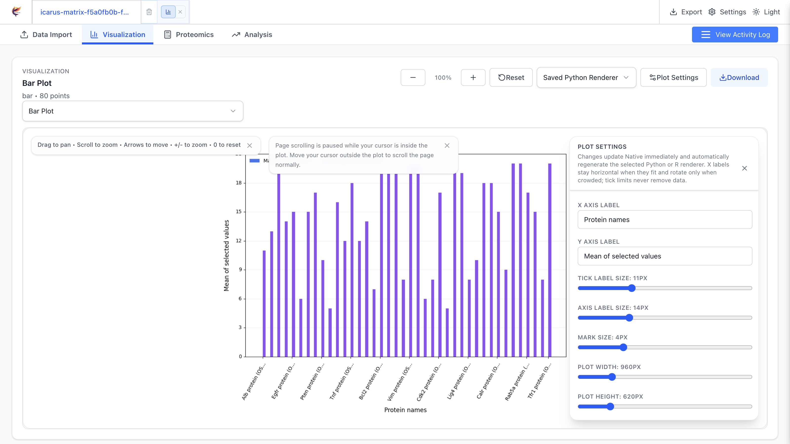

#### Settings and export

Settings sheet with theme selection (`light`, `dark`, `system`), export defaults, storage usage, and the export sheet with format, delimiter, and scope options.

###### Settings — dark mode
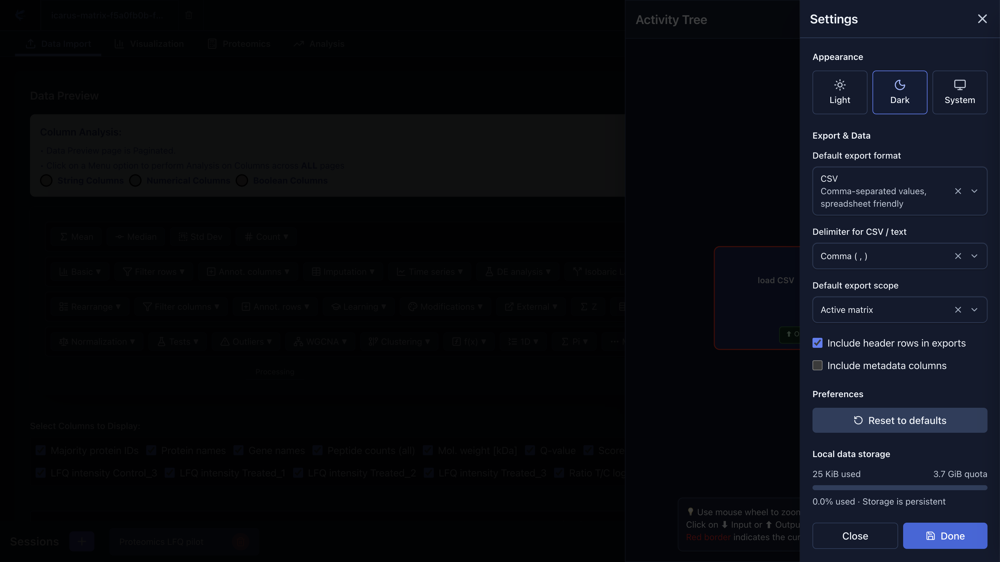

###### Export — dark mode
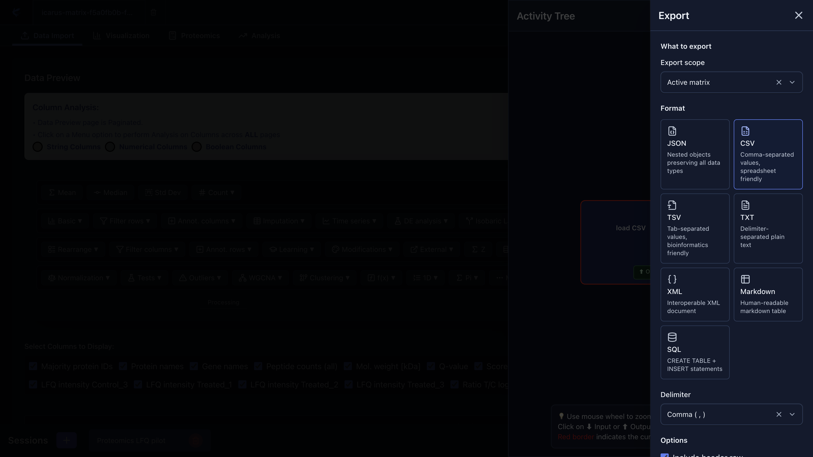

###### Settings — light mode
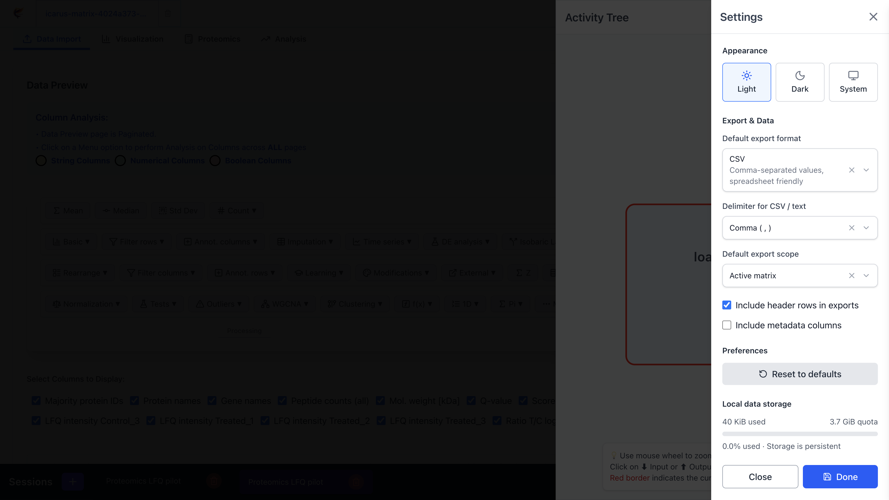

###### Export — light mode
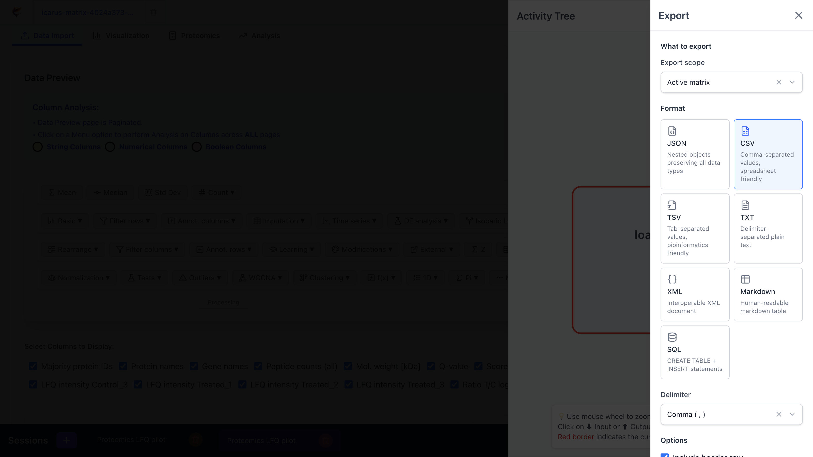


---

## Tech Stack

| Category | Tools |
| --- | --- |
| Desktop app | Electron |
| Frontend | React, TypeScript |
| Styling | Tailwind CSS, tailwind-variants |
| Charts and visuals | Python (Matplotlib, Seaborn), R (ggplot2), Recharts, D3 |
| Statistics | NumPy, SciPy, scikit-learn, Bioconductor LIMMA, WGCNA, jStat, simple-statistics |
| Data handling | Single-pass columnar parser (`ColumnarTable`: `Float64Array` numeric columns, `"N/A"` missing) with Papa Parse fallback |
| Local storage / persistence | SQLite workflow storage |

---

## Getting Started

```bash
git clone <repo-url>
cd mission-icarus
npm install
npm start
```

### Useful commands

```bash
# dev bundle refresh before Electron start
npm run prestart

# lint
npm run lint

# typecheck
npx tsc --noEmit

# desktop build
npm run build
```

Desktop packaging fingerprints the Python, R, and F# renderer sources and
generated executables before it runs. Missing or stale runtimes for the current
platform are rebuilt and smoke-tested automatically; unchanged runtimes are
reused. Rebuilding requires
Python 3.13 with Pipenv, R with `jsonlite`, `ggplot2`, and `ragg`, and the .NET 10
SDK. Nuitka's content-addressed compiler cache is retained between Python
renderer rebuilds; set `ICARUS_CLEAN_NUITKA_CACHE=1` for a completely cold
compiler rebuild. GitHub Actions persists the compiler cache separately for
each OS, architecture, Python dependency lock, and renderer source revision,
and additionally caches the prepared runtime artifacts keyed by renderer
sources. Unchanged renderers are skipped so routine builds reuse the cached
executables. Rebuilt runtimes are always smoke-tested, and CI smoke-tests the
bundled runtimes on every run even when all renderers are cached. A manual
`workflow_dispatch` with `force_rebuild` restores a fully fresh rebuild; checking
`clean_nuitka_cache` at the same time also wipes Nuitka's compiler cache so the
Python renderer is rebuilt with a fully cold C compiler.

---

## Notes

- macOS notarization still requires Apple credentials; unsigned fallback packaging is supported for environments without them
- visualization creation is intentionally centralized in the visualization plot library so statistical calculations remain distinct from plot generation
