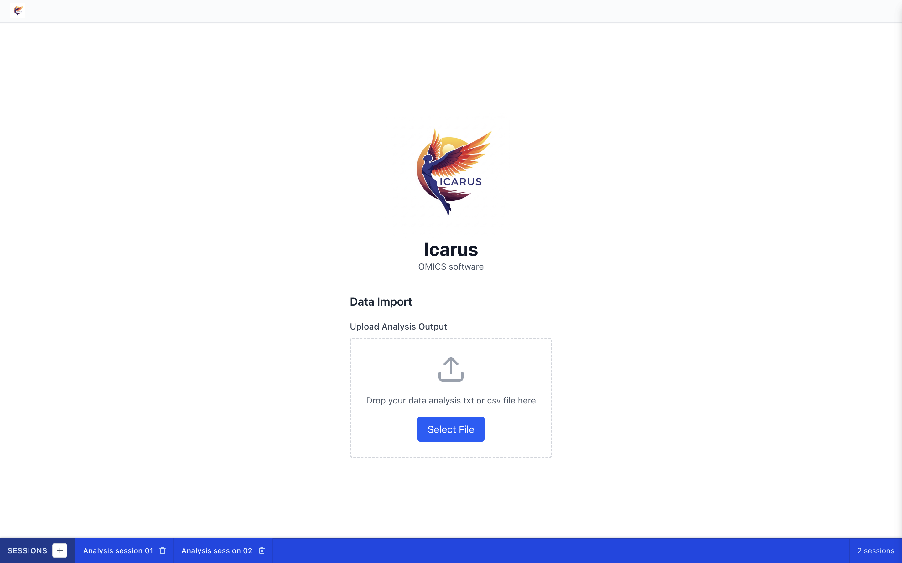
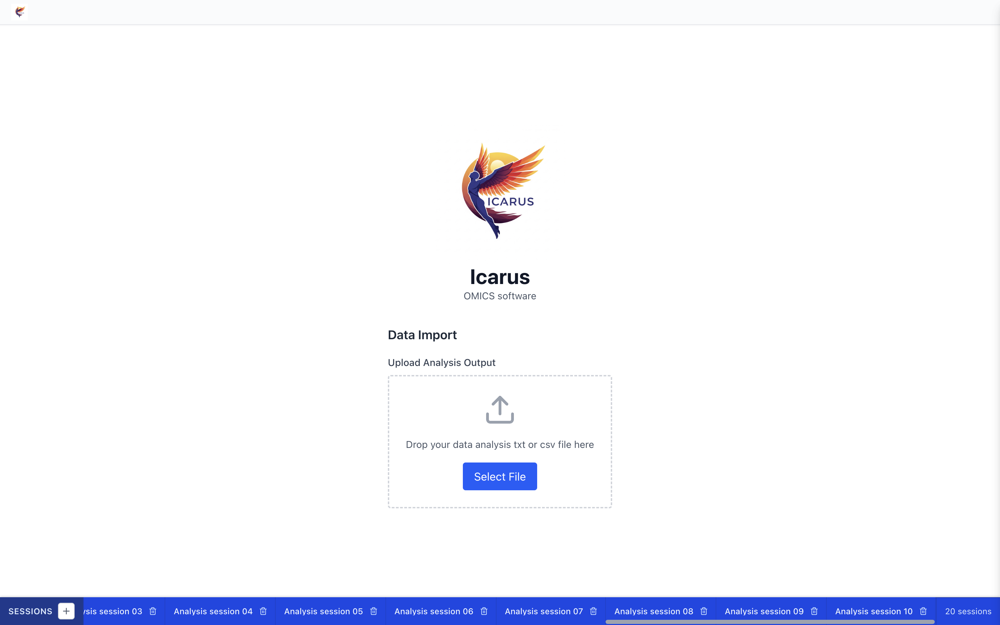
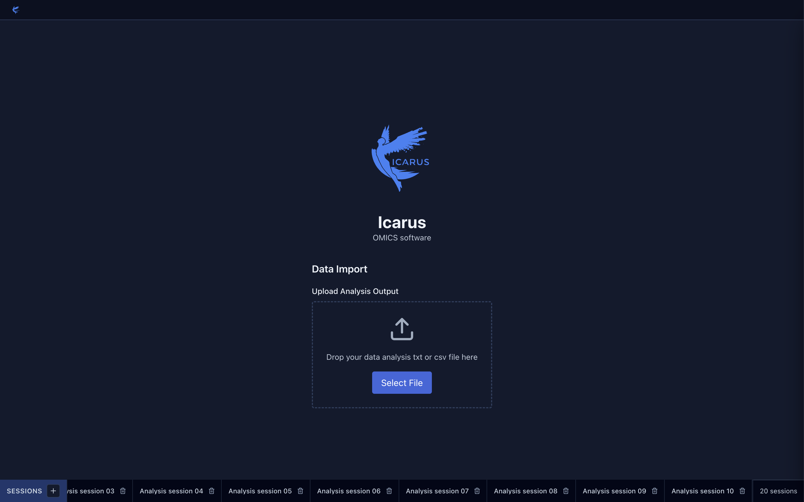

# Desktop window and session bar validation

Verified on macOS with Electron 30 and the production renderer build, using a temporary user-data directory and synthetic sessions. No personal data was used.

- `npm run build:application`: passed (TypeScript and Vite renderer/main/preload builds).
- ESLint on the three changed source files: passed.
- `git diff --check`: passed.
- Launch: native fullscreen is enabled (`isFullScreen()` returned true). The maximize call is also retained before showing the window.
- Zero sessions: the main view correctly hides the session bar.
- Two sessions: the scroll region ends exactly at the count, with no horizontal overflow.
- Twenty sessions: the scroll region ends exactly at the count, can scroll to the last tab, and does not cause page overflow.
- Closing the last BrowserWindow emitted the application `quit` event and the Electron process exited with code 0.

See [runtime results](runtime.txt) for measured geometry and lifecycle results. Windows/Linux were not runtime-tested.

## Screenshots

Two sessions, light mode:

Twenty sessions scrolled to the end, light mode:

Twenty sessions scrolled to the end, dark mode:

## Manual reproduction

1. Build and start Icarus on macOS. Confirm the window opens in native fullscreen.
2. Create two sessions. Confirm the bottom strip uses all the space between the Sessions header and session count.
3. Create enough sessions to exceed that space. Scroll horizontally to reach the last tab; the count remains visible.
4. Check both light and dark themes.
5. Close the last window with its close control. Confirm the app exits and its Dock running indicator disappears.
